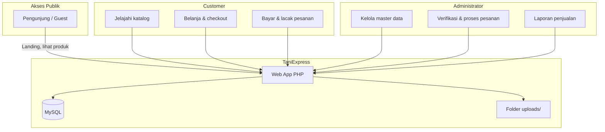
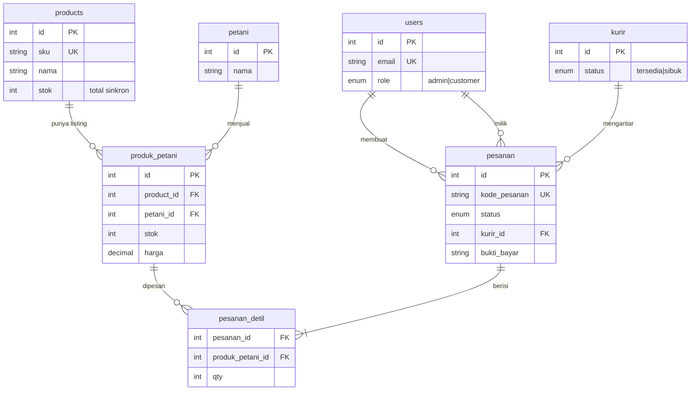
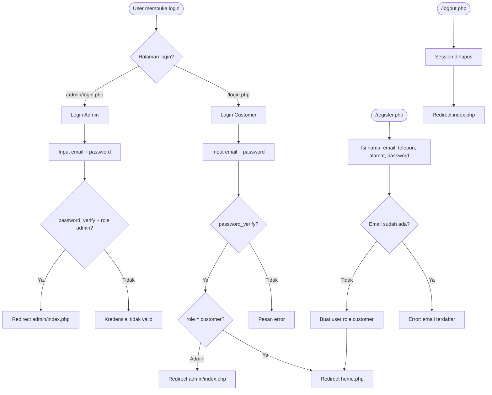
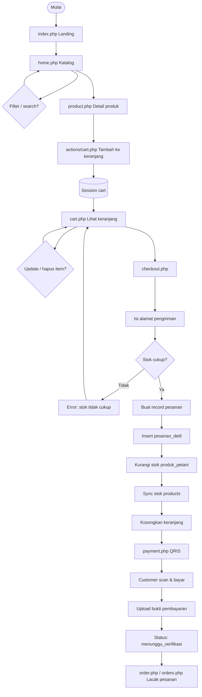
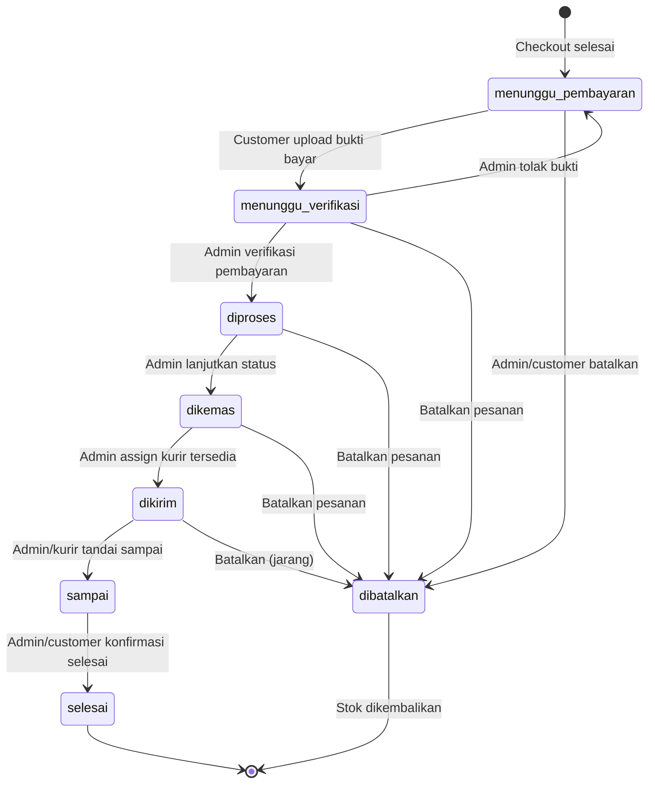
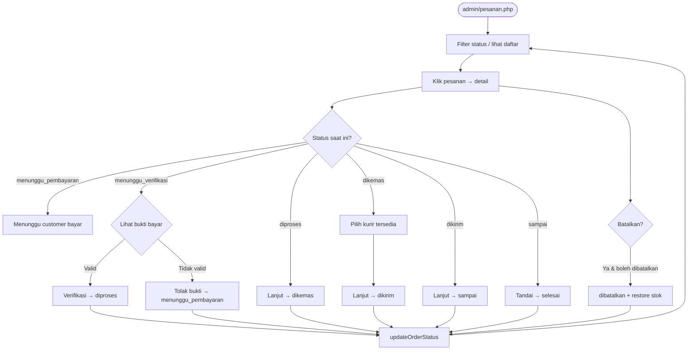
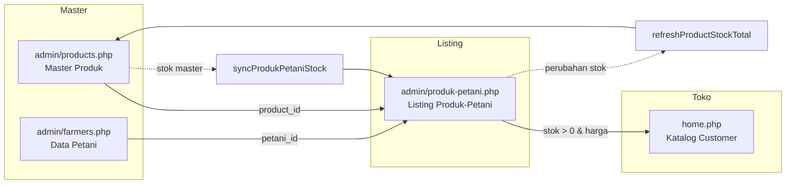
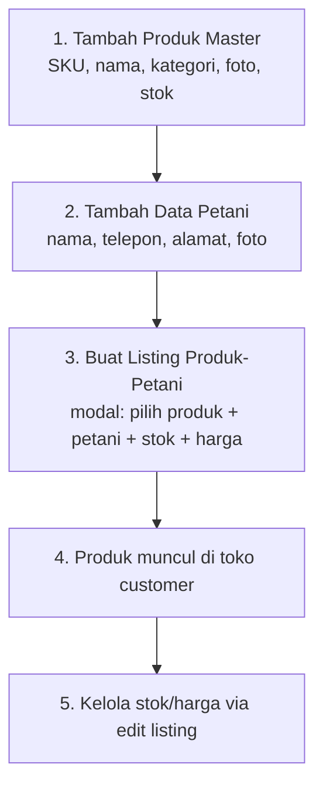
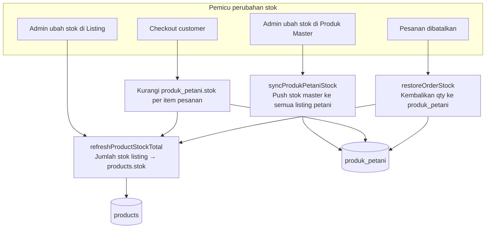
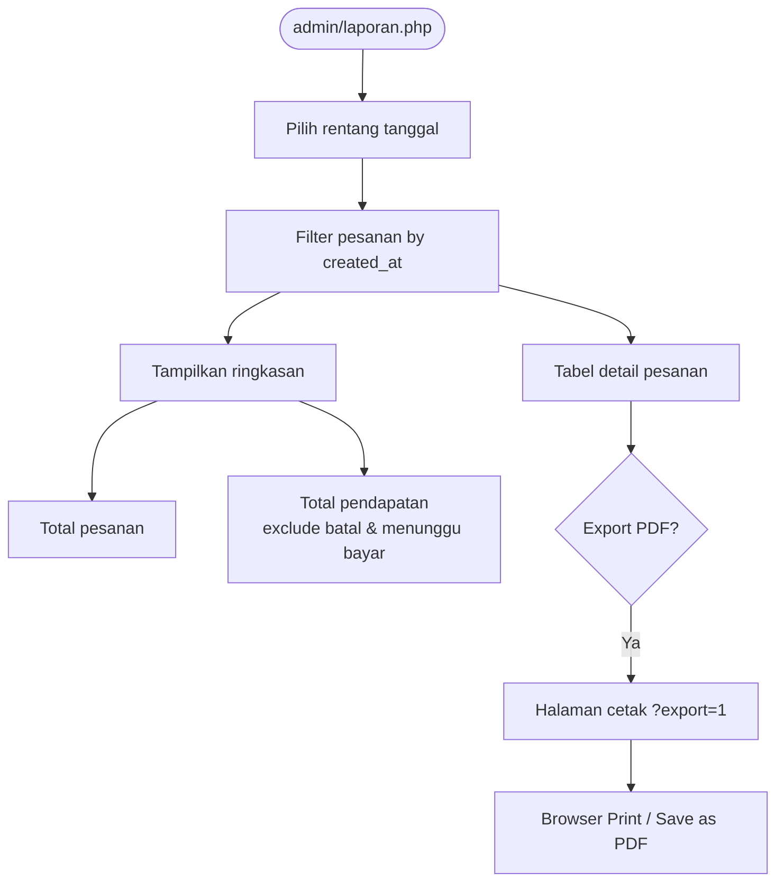

# TaniExpress

Aplikasi e-commerce sayuran segar dari petani lokal. Dibangun dengan **PHP**, **MySQL**, dan **Tailwind CSS**.

---

## Daftar Isi

1. [Fitur](#fitur)
2. [Instalasi](#instalasi)
3. [Akun Default](#akun-default)
4. [Struktur Folder](#struktur-folder)
5. [Diagram Alur Lengkap](#diagram-alur-lengkap)
   - [Aktor & Peran Sistem](#1-aktor--peran-sistem)
   - [Arsitektur Data](#2-arsitektur-data)
   - [Autentikasi](#3-alur-autentikasi)
   - [Belanja Customer](#4-alur-belanja-customer)
   - [Status Pesanan](#5-alur-status-pesanan)
   - [Kelola Pesanan Admin](#6-alur-kelola-pesanan-admin)
   - [Setup Katalog Admin](#7-alur-setup-katalog-admin)
   - [Sinkronisasi Stok](#8-alur-sinkronisasi-stok)
   - [Laporan Admin](#9-alur-laporan-admin)

---

## Fitur

### Pembeli (Customer)
- Landing page dengan hero slider dinamis
- Beranda produk, pencarian, filter kategori & petani
- Detail produk, produk terpopuler, produk serupa
- Keranjang belanja (session)
- Checkout, pembayaran QRIS, upload bukti bayar
- Lacak status pesanan
- Registrasi, login, kelola akun & ubah password

### Admin
- Dashboard (stok, pesanan perlu aksi, status kurir)
- CRUD Produk, Petani, Listing Produk-Petani (modal), Kurir
- Kelola pesanan & verifikasi pembayaran
- Assign kurir & update status pengiriman berurutan
- Laporan pesanan per periode (export/cetak PDF)
- Kelola akun admin & ubah password

---

## Instalasi

### 1. Persyaratan
- PHP 8.0+
- MySQL / MariaDB
- Extension PHP: `pdo_mysql`

### 2. Konfigurasi Database

Edit `config/config.php`:

```php
define('DB_HOST', 'localhost');
define('DB_NAME', 'taniexpress');
define('DB_USER', 'root');
define('DB_PASS', '');
```

### 3. Install Database

```bash
cd taniexpress
php install.php
```

Reset database (hapus semua data):

```bash
php install.php --fresh
```

### 4. Jalankan Server

```bash
php -S localhost:8000
```

Buka: **http://localhost:8000**

| URL | Keterangan |
|-----|------------|
| `/` | Landing page |
| `/home.php` | Toko / katalog |
| `/admin/login.php` | Panel admin |

---

## Akun Default

| Role | Email | Password |
|------|-------|----------|
| Admin | admin@taniexpress.com | admin123 |
| Customer | customer@taniexpress.com | admin123 |

---

## Struktur Folder

```
taniexpress/
├── index.php              # Landing page
├── home.php               # Katalog produk (toko)
├── product.php            # Detail produk
├── cart.php               # Keranjang
├── checkout.php           # Checkout
├── payment.php            # Pembayaran QRIS + upload bukti
├── orders.php             # Riwayat pesanan
├── order.php              # Detail & tracking pesanan
├── account.php            # Profil customer
├── login.php / register.php
├── admin/                 # Panel admin
│   ├── index.php          # Dashboard
│   ├── products.php       # CRUD produk master
│   ├── farmers.php        # CRUD petani
│   ├── produk-petani.php  # Listing stok & harga per petani
│   ├── kurir.php          # CRUD kurir
│   ├── pesanan.php        # Kelola pesanan
│   ├── laporan.php        # Laporan & export
│   └── account.php        # Profil admin
├── actions/cart.php       # Handler keranjang
├── config/config.php      # Konfigurasi DB & app
├── includes/              # Bootstrap, auth, UI, helpers
├── database/schema.sql    # Schema + seed data
├── install.php            # Installer
└── uploads/               # Foto produk, petani, bukti bayar
```

---

## Diagram Alur Lengkap

### 1. Aktor & Peran Sistem



---

### 2. Arsitektur Data

Relasi utama antar entitas:



**Konsep penting:**
- **products** = master produk (SKU, kategori, foto)
- **produk_petani** = listing di toko (stok & harga per petani)
- Produk tampil di toko customer hanya jika ada listing `produk_petani` dengan `stok > 0`

---

### 3. Alur Autentikasi



---

### 4. Alur Belanja Customer



---

### 5. Alur Status Pesanan

State machine status pesanan (alur normal + cabang):



| Status | Keterangan |
|--------|------------|
| `menunggu_pembayaran` | Pesanan dibuat, menunggu bayar QRIS |
| `menunggu_verifikasi` | Bukti bayar diupload, menunggu admin |
| `diproses` | Pembayaran diverifikasi |
| `dikemas` | Pesanan sedang disiapkan |
| `dikirim` | Kurir ditugaskan & barang dalam perjalanan |
| `sampai` | Barang sampai di customer |
| `selesai` | Transaksi selesai |
| `dibatalkan` | Dibatalkan, stok dikembalikan |

**Aturan transisi:**
- Status hanya bisa maju **satu langkah** (tidak boleh loncat)
- Ke `dikirim` wajib pilih **kurir tersedia**
- Ke `dibatalkan` mengembalikan stok via `restoreOrderStock()`
- Kurir dilepas (`tersedia`) saat pesanan `selesai` atau `dibatalkan`

---

### 6. Alur Kelola Pesanan Admin



---

### 7. Alur Setup Katalog Admin

Data harus disiapkan agar produk muncul di toko:



**Langkah setup (urutan disarankan):**



**Catatan listing:**
- Satu kombinasi **produk + petani** hanya boleh **1 baris** (`unique_produk_petani`)
- Tambah/edit listing memakai **modal** di halaman Produk-Petani

---

### 8. Alur Sinkronisasi Stok



---

### 9. Alur Laporan Admin



---

## Ringkasan Alur Pesanan (Teks)

1. Customer checkout → `menunggu_pembayaran` (stok langsung dikurangi)
2. Upload bukti QRIS → `menunggu_verifikasi`
3. Admin verifikasi → `diproses` → `dikemas` → `dikirim` (wajib kurir) → `sampai` → `selesai`
4. Jika dibatalkan → stok dikembalikan, kurir dilepas

---

## Teknologi

| Layer | Stack |
|-------|-------|
| Backend | PHP 8 (native, PDO) |
| Database | MySQL / MariaDB |
| Frontend | Tailwind CSS (CDN), Material Symbols |
| Session | Keranjang belanja PHP session |
| Upload | Foto produk/petani, bukti pembayaran |

---

## Lisensi

Proyek edukasi / internal — AA Enterprise.
